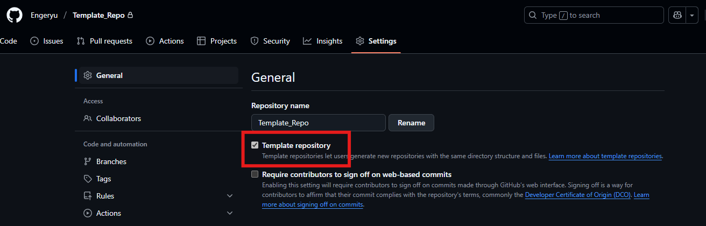

# 🛠️ GitHub CLI Repository Initialization

If you don't know what `gh` is or can't execute it, check [🧰Git &amp; GitHub Initialization Guide](./github_git_init.md)!

---

## 📁 Repository Listing (anywhere):

* `gh repo list # List all your Github repository, with desciption, visibility and last repository update`

---

## 🆕 Repository Creation (If you didn't create folder yet):

* `gh repo create repository_name --visibility --clone`
  (Replace `--visibility` with `--private` or `--public`)
* Then you can go into the newly created folder and follow instructions!

---

## 🔁 Create and Link Local Project to Remote (from the root of your project folder):

```bash
git init -b main
gh repo create repository_name --visibility # Don't need to do that if you did the last step `Repository Creation`
git remote add origin git@github.com:Username/repo_name.git
git pull # Needed if you created your repository from Web
git add .
git commit -m "Your comments"
git push -u origin main
```

---


You can also create a template repository, here is my advice :

- Create a folder with a README.md, SECURITY.md, CODE_OF_CONDUCT.md and LICENSE files inside it
- You follow the steps of repository creation, then go to the repository settings in the website
- Check `Template Repository:`



Then for every new repository you write :

- ```
  gh repo create repository_name --visibility --template=Template_repository
  git init -b main
  git remote add origin git@github.com:Username/repository_name.git
  git pull
  git add .
  git commit -m "Your comments"
  git push -u origin main
  ```

## 🗑️ Repository Deletion (from the root of your project folder):

* `gh repo delete repository_name --yes`

---

## 🧩Reepository errors, and more information (Everything in one code block, but every commands here are independant)

```
gh repo edit --description "Here is your description" # Add a description to add a context before users click upon your repository
gh repo rename repository_name2 # Rename Github repository
git remote set-url origin git@github.com:Username/repository_name2.git # Rename remote link in your local .git
```

---

## ✅ All Set!

You just created your first repository without opening GitHub.com—well done!
You can read the [GitHub CLI Repository Management](./03-Github_Repo_Managment.md) to learn how to manage your repositories directly from your local machine!

**📚 PS:** If you want to deepen your knowledge of Git and GitHub configuration, here are the links to the [Git Documentation](https://git-scm.com/docs), the [GitHub-CLI Documentation](https://cli.github.com/manual/), and the [GitHub Documentation](https://docs.github.com/en).

🚀 Feel free to check other [guides](../README.md) to learn more technos!
